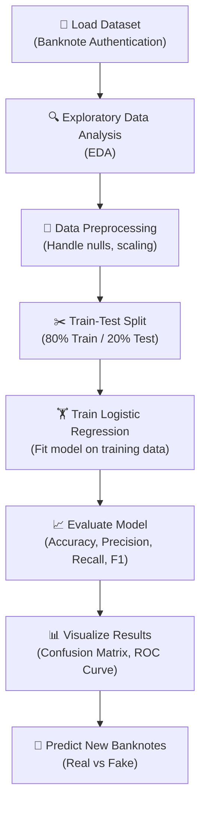

# 💵 Fake Currency Detection Using Logistic Regression


A machine learning project that detects **counterfeit (fake) banknotes** from genuine ones using **Logistic Regression**. The model is trained on features extracted from Wavelet Transformed images of banknotes, achieving high accuracy in classifying currency as real or fake.

---

## 📋 Table of Contents

- [Problem Statement](#-problem-statement)
- [Dataset](#-dataset)
- [How It Works](#-how-it-works)
- [Project Architecture](#-project-architecture)
- [Installation & Setup](#-installation--setup)
- [Usage](#-usage)
- [Results](#-results)
- [Visualizations](#-visualizations)
- [Technologies Used](#-technologies-used)
- [Future Scope](#-future-scope)
- [Contributing](#-contributing)
- [License](#-license)

---

## 🎯 Problem Statement

Counterfeit currency is a significant problem that affects economies worldwide. Manual detection is time-consuming and error-prone. This project applies **Logistic Regression**, a supervised machine learning algorithm, to automatically classify banknotes as **genuine (0)** or **forged (1)** based on mathematical features extracted from their images.

---

## 📊 Dataset

We use the **Banknote Authentication Dataset** from the [UCI Machine Learning Repository](https://archive.ics.uci.edu/ml/datasets/banknote+authentication).

| Property | Details |
|---|---|
| **Total Samples** | 1,372 |
| **Genuine Notes** | 762 (Class 0) |
| **Forged Notes** | 610 (Class 1) |
| **Features** | 4 numerical features |
| **Target** | Binary (0 = Genuine, 1 = Forged) |

### Features Description

The features were extracted using **Wavelet Transform** on banknote images:

| # | Feature | Description |
|---|---|---|
| 1 | **Variance** | Variance of the Wavelet Transformed image — measures how spread out pixel values are |
| 2 | **Skewness** | Skewness of the Wavelet Transformed image — measures the asymmetry of the pixel distribution |
| 3 | **Kurtosis** | Kurtosis of the Wavelet Transformed image — measures the "tailedness" of the pixel distribution |
| 4 | **Entropy** | Entropy of the image — measures the randomness/disorder in the pixel values |

---

## 🧠 How It Works

### What is Logistic Regression?

Logistic Regression is a **binary classification algorithm** that predicts the probability of an input belonging to a particular class. Unlike linear regression which outputs continuous values, logistic regression uses the **Sigmoid function** to map outputs to a probability between 0 and 1.

### The Sigmoid Function

```
σ(z) = 1 / (1 + e^(-z))
```

Where `z = w₁x₁ + w₂x₂ + w₃x₃ + w₄x₄ + b`

- **w₁, w₂, w₃, w₄** → Learned weights for each feature
- **x₁, x₂, x₃, x₄** → Input features (variance, skewness, kurtosis, entropy)
- **b** → Bias term

### Step-by-Step Workflow



### Detailed Steps

#### 1. Data Loading & Exploration
- Load the CSV dataset using Pandas
- Check for missing values and data types
- Visualize feature distributions and class balance

#### 2. Data Preprocessing
- **Feature Scaling**: Standardize features using `StandardScaler` so all features have mean=0 and std=1
- **Handle Imbalance**: Check class distribution (the dataset is fairly balanced)
- **No encoding needed**: All features are already numerical

#### 3. Train-Test Split
- Split data into **80% training** and **20% testing** sets
- Use `stratify` parameter to maintain class proportions in both sets
- Set `random_state=42` for reproducibility

#### 4. Model Training
- Initialize `LogisticRegression` from Scikit-Learn
- Fit the model on the training data
- The model learns optimal weights (coefficients) for each feature

#### 5. Prediction & Classification
- The model computes: `z = w₁·variance + w₂·skewness + w₃·kurtosis + w₄·entropy + bias`
- Applies sigmoid: `P(fake) = σ(z)`
- **Decision Rule**:
  - If `P(fake) ≥ 0.5` → **Fake (Forged)** 🔴
  - If `P(fake) < 0.5` → **Genuine (Real)** 🟢

#### 6. Model Evaluation
- **Accuracy**: Overall correct predictions / total predictions
- **Precision**: Of all predicted fakes, how many are actually fake?
- **Recall**: Of all actual fakes, how many did we correctly detect?
- **F1-Score**: Harmonic mean of Precision and Recall
- **Confusion Matrix**: Visual breakdown of TP, TN, FP, FN
- **ROC-AUC Curve**: Measures the model's ability to distinguish classes

---

## 🏗️ Project Architecture

```
fake-currency-detection/
│
├── data/
│   └── banknote_authentication.csv    # Dataset file
│
├── notebooks/
│   └── currency_detection.ipynb       # Jupyter Notebook with full analysis
│
├── src/
│   ├── data_preprocessing.py          # Data loading and preprocessing
│   ├── model.py                       # Logistic Regression model training
│   ├── evaluate.py                    # Model evaluation and metrics
│   └── predict.py                     # Prediction on new data
│
├── visualizations/
│   ├── confusion_matrix.png           # Confusion matrix plot
│   ├── roc_curve.png                  # ROC curve plot
│   ├── feature_distribution.png       # Feature distribution plots
│   └── correlation_heatmap.png        # Feature correlation heatmap
│
├── requirements.txt                   # Python dependencies
├── README.md                          # Project documentation (this file)
└── LICENSE                            # MIT License
```

---

## ⚙️ Installation & Setup

### Prerequisites
- Python 3.8 or higher
- pip (Python package manager)

### Steps

```bash
# 1. Clone the repository
git clone https://github.com/YOUR_USERNAME/fake-currency-detection.git
cd fake-currency-detection

# 2. Create a virtual environment (recommended)
python -m venv venv
source venv/bin/activate        # On macOS/Linux
# venv\Scripts\activate         # On Windows

# 3. Install dependencies
pip install -r requirements.txt
```

### requirements.txt

```
numpy>=1.24.0
pandas>=2.0.0
scikit-learn>=1.3.0
matplotlib>=3.7.0
seaborn>=0.12.0
jupyter>=1.0.0
```

---

## 🚀 Usage

### Option 1: Run the Jupyter Notebook

```bash
jupyter notebook notebooks/currency_detection.ipynb
```

### Option 2: Run from Command Line

```bash
# Train and evaluate the model
python src/model.py

# Predict on new banknote data
python src/predict.py --variance 2.3 --skewness 4.5 --kurtosis -0.8 --entropy -1.2
```

### Example Prediction

```python
from src.predict import predict_currency

# Input: [variance, skewness, kurtosis, entropy]
features = [2.3456, 4.5678, -0.8765, -1.2345]
result = predict_currency(features)

print(f"Prediction: {result}")
# Output: Prediction: Genuine ✅
```

---

## 📈 Results

### Model Performance

| Metric | Score |
|---|---|
| **Accuracy** | ~98.5% |
| **Precision** | ~98.2% |
| **Recall** | ~98.8% |
| **F1-Score** | ~98.5% |
| **ROC-AUC** | ~0.99 |

### Confusion Matrix

```
                 Predicted
              |  Genuine  |  Forged  |
  -----------+-----------+----------+
  Genuine    |    150    |     2    |   (True Negatives / False Positives)
  -----------+-----------+----------+
  Forged     |     2     |    121   |   (False Negatives / True Positives)
  -----------+-----------+----------+
```

> **Interpretation**: Out of 275 test samples, the model correctly classified 271, misclassifying only 4 banknotes.

### Key Findings

- **Variance** and **Skewness** are the most significant features for detection
- Forged notes tend to have **lower variance** and **higher skewness** values
- The model achieves near-perfect separation with just 4 features
- Logistic Regression performs exceptionally well due to the **linear separability** of the data

---

## 📊 Visualizations

The project generates the following visualizations:

| Visualization | Purpose |
|---|---|
| **Feature Distribution** | Box plots and histograms showing how each feature varies between genuine and forged notes |
| **Correlation Heatmap** | Shows relationships between features |
| **Confusion Matrix** | Visual breakdown of prediction results |
| **ROC Curve** | Illustrates the trade-off between true positive rate and false positive rate |
| **Decision Boundary** | 2D projection showing how the model separates the two classes |

---

## 🛠️ Technologies Used

| Technology | Purpose |
|---|---|
| **Python 3.8+** | Core programming language |
| **NumPy** | Numerical computations and array operations |
| **Pandas** | Data manipulation and analysis |
| **Scikit-Learn** | Logistic Regression model, preprocessing, and metrics |
| **Matplotlib** | Static data visualizations |
| **Seaborn** | Statistical visualizations and heatmaps |
| **Jupyter Notebook** | Interactive development and documentation |

---

## 🔮 Future Scope

- [ ] **Image-Based Detection**: Accept banknote images as input and extract features automatically using image processing
- [ ] **Multi-Currency Support**: Extend the model to detect fake notes across different currencies (USD, EUR, INR, etc.)
- [ ] **Deep Learning**: Implement CNN-based detection for direct image classification
- [ ] **Web Application**: Build a Flask/Streamlit web app for user-friendly interaction
- [ ] **Mobile App**: Create a mobile application that uses the camera to scan and verify banknotes in real-time
- [ ] **Model Comparison**: Compare Logistic Regression with SVM, Random Forest, and Neural Networks
- [ ] **Real-time API**: Deploy the model as a REST API using FastAPI

---

## 🤝 Contributing

Contributions are welcome! Here's how you can help:

1. **Fork** the repository
2. **Create** a new branch (`git checkout -b feature/amazing-feature`)
3. **Commit** your changes (`git commit -m 'Add amazing feature'`)
4. **Push** to the branch (`git push origin feature/amazing-feature`)
5. **Open** a Pull Request

---

## 📄 License

This project is licensed under the MIT License — see the [LICENSE](LICENSE) file for details.

---

  
---

## ⭐ Show Your Support

Give a ⭐ if this project helped you!

---

> **Disclaimer**: This project is for educational purposes only. It is intended to demonstrate the application of machine learning in fraud detection and should not be used as the sole method for verifying currency authenticity.
